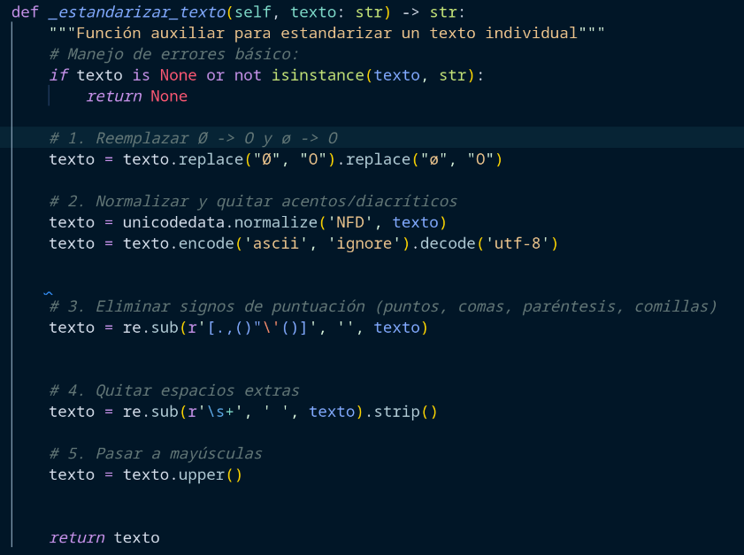
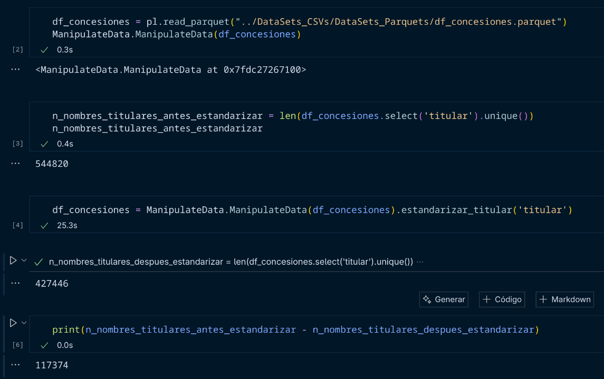
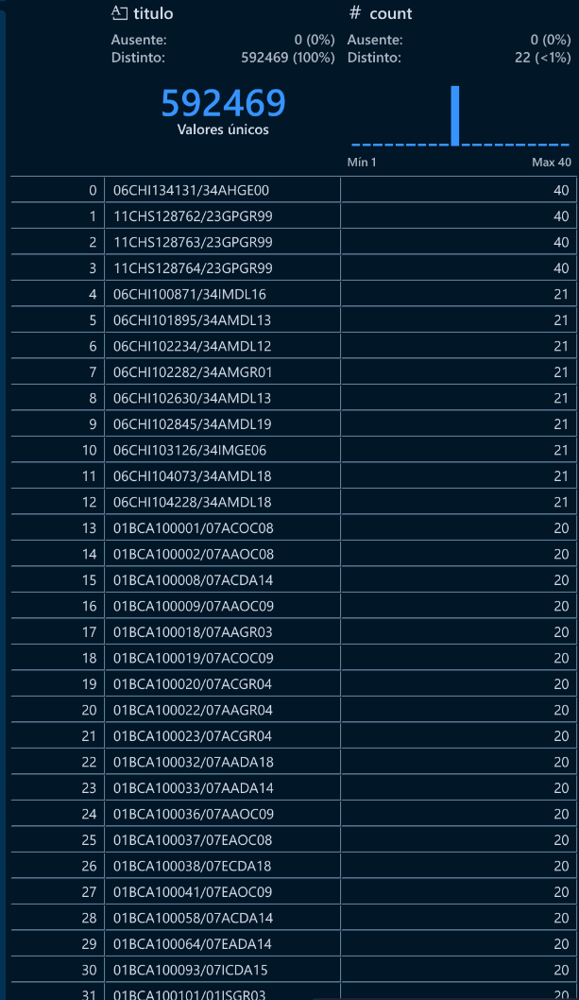
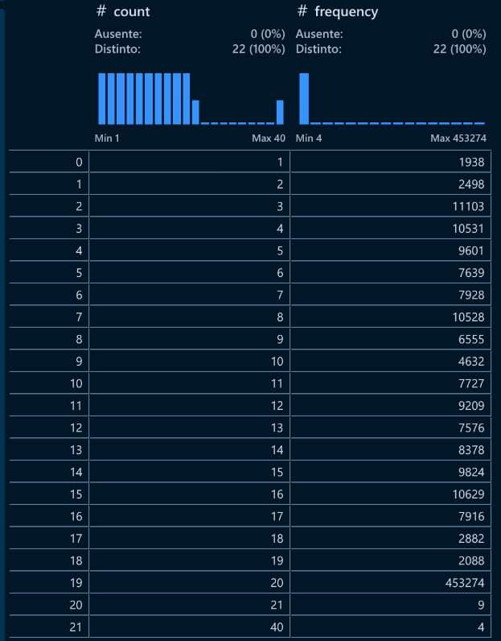
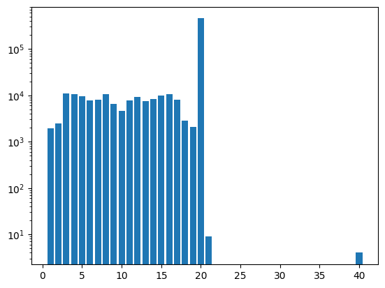

# Análisis de anomalías en los derechos de agua

### Primeros procedimientos

Comenzamos analizando los titulares y viendo posibles anomalías en los relacionadas con la forma en la que se encuentran escritos, lo que hice(no esta en codigo pero es sencillo de replicar) fue ordernar los titulares de forma descendente de acuerdo a su número de ocurrencias, revise de forma manual filtrando el dataset por algunos de esos titulos con mas ocurrencias viendo que tenian valores unicos en 'titular' con 3 o mas, pero que parecian ser menos solo con pequeñas variaciones en la escritura.

Entonces para esto lo primero que hice fue aplicar una primera capa de estandarizado que no llegue afectar los nombres, simplemente elimine espacios en blanco, acentos, diacríticos y caracteres especiales (muy frecuente el caso de "Ø", "O"), y cosas como comillas, comas, parentecis etc.

y solo por no dejar asegurar que todo quede en mayúsculas, aplique la función upper() a la columna 'titular'(aunque aparentemente todo esta en mayúsculas).

**Pasos realizados:**

---
Otro pre analisis que realice fue el hecho de ver que tanto se repetian los titulos, visualizar su frecuencia, ya que estonces estos titulos con mayor numero de ocurrencias seria los titulos o concesiones con mayor probabilidad de contener anomalías.

